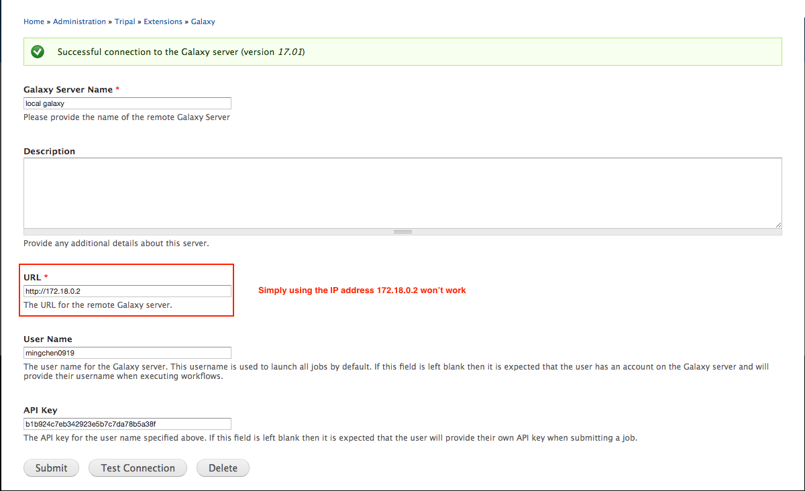

# Working directory

First of all, always create a temporary working directory. Whenever starting working on the project, pull the code
from github repositories and place them into this working directory. When stopping working, push the code to github
and remove everything from the local computer.


``` 
mkdir -p ~/Desktop/test-tripal-galaxy && cd ~/Desktop/test-tripal-galaxy

git clone https://github.com/galaxyproject/blend4php.git
git clone https://github.com/statonlab/tripal_galaxy.git

# create a directory to mount to the docker container's tool directory so that I can update or debug tools from the host machine
mkdir shed_tools
```

# Docker container network

This project needs two containers running and talking to each other. One container is
for a Tripal site and the other is for a Galaxy instance.


# [Create a docker network](https://docs.docker.com/engine/userguide/networking/#bridge-networks)

```
docker network create --driver bridge tripal_galaxy_nw
```


## Launch containers on the created network.

* Launch Tripal site

``` 
docker run -it --rm --network=tripal_galaxy_nw --name=tripal_site \
        -v $(pwd)/blend4php:/var/www/html/sites/all/libraries/blend4php \
        -v $(pwd)/tripal_galaxy:/var/www/html/sites/all/modules/tripal_galaxy \
        -p 80:80 mingchen0919/docker-tripal-v3 /bin/bash
        
drush en tripal_galaxy -y

# elasticsearch is not needed, so stop elasticsearch
service elasticsearch_node-01 stop
service elasticsearch_node-02 stop
```

* Launch Galaxy instance

```
# option 1: use the base docker galaxy image created by Björn Grüning (https://github.com/bgruening/docker-galaxy-stable)
docker run -it --rm --network=tripal_galaxy_nw --name=galaxy_instance \
        -p 8080:80 -p 8021:21 -p 8022:22 \
        -v $(pwd)/shed_tools:/export/shed_tools \ 
        -e "ENABLE_TTS_INSTALL=True" \
        -e "GALAXY_CONFIG_ADMIN_USERS=admin@galaxy.org" \
        bgruening/galaxy-stable:17.01 /bin/bash
    
    
# option 2: use another docker image which has some tools installed
# DO NOT mount to the /export/shed_tools directory since it is not empty!
docker run -it --rm --network=tripal_galaxy_nw --name=galaxy_instance \
        -p 8080:80 -p 8021:21 -p 8022:22 \
        -e "ENABLE_TTS_INSTALL=True" \
        -e "GALAXY_CONFIG_ADMIN_USERS=admin@galaxy.org" \
        mingchen0919/docker-tripal-galaxy /bin/bash
```

## Login to Galaxy instance

* username: admin@galaxy.org
* password: admin

## Obtain container IP address

``` 
docker network inspect tripal_galaxy_nw
```

The command above will output a JSON array. Within the `containers` filed, all the API address info will show up for each container.


The **Tripal Galaxy** module uses URL not IP address to connect to a Galaxy instance. See the screenshot below:




# Galaxy API

example: api to display bowtie2 xml for building webform components

api/tools/toolshed.g2.bx.psu.edu/repos/devteam/bowtie2/bowtie2/2.3.2.2
api/tools/toolshed.g2.bx.psu.edu/repos/devteam/bowtie2/bowtie2/2.3.2.2/build
